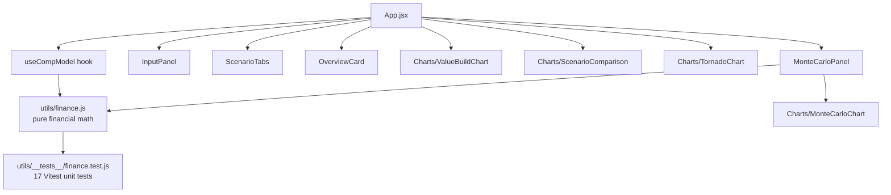

# Executive Compensation Structuring Model — v2


**[Live demo →](https://george-anya.github.io/executive-compensation-model-v2/)**

An interactive model for structuring and evaluating founder/executive compensation packages
— cash, RSUs, and stock options — across manual exit scenarios **and** a Monte Carlo
simulation calibrated to published venture-return data. Built to mirror the kind of
financial modeling used in executive compensation and founder advisory work, where the
real question is always: *what is this package actually worth, and how does that change
under different outcomes?*

## Preview

*(Add a screenshot or short GIF of the dashboard here — drag an image into this README
directly on GitHub and it will generate the markdown link for you automatically.)*

## Features

- **Package structuring** — models cash salary, RSU grants, and stock options together as
  one package, with realistic time-based vesting and a cliff
- **Manual exit scenarios** — three editable Downside / Base / Upside company valuations,
  with full interactive control over every input (salary, grant size, strike price,
  dilution, time to exit)
- **Dynamic scenario switching** — tabbed interface recalculates the entire package value
  build-up live as you change scenario or inputs
- **Stacked area chart** — shows how cash, RSU, and option value accrue year over year as
  the package vests
- **Scenario comparison chart** — side-by-side package value across all three exit scenarios
- **Sensitivity ("tornado") analysis** — flexes each assumption ±20% independently and shows
  which one actually moves the outcome most
- **Monte Carlo simulation** — an additional, independent view that runs 10,000 simulated
  outcomes using a real empirical return-multiple distribution (see Methodology below),
  reporting P10 / P50 / P90 and a full histogram instead of picking three numbers by hand

## Architecture



All financial calculations live in `src/utils/finance.js`, fully decoupled from
rendering — no React, no state — so they can be (and are) unit tested in isolation.
`src/hooks/useCompModel.js` owns all application state and memoized derived data;
`App.jsx` itself is pure composition, under 50 lines.

## Methodology & data sources

**Manual scenarios** assume company valuation moves linearly from the current valuation
toward the chosen exit value, with dilution compounding annually — a simplifying
assumption for illustration, disclosed in-app, not a valuation forecast.

**The Monte Carlo engine** is calibrated against published data rather than invented
numbers:

| Input | Source |
|---|---|
| Return-multiple distribution (power law, α=2.05, x_min=0.35) | Moonfire Ventures ([arXiv:2303.11013](https://arxiv.org/abs/2303.11013)), fit to Correlation Ventures' dataset of 21,000+ venture financings |
| Time-to-exit by outcome size (~3yr / ~6yr / ~10yr medians) | Y Combinator 2025 exit-cohort analysis |
| Dilution per round (~13%, every ~2.25 years) | Carta Q3 2025 report on inter-round timing and dilution |

This repurposes VC financing-return data as a proxy for a single company's valuation
growth from grant to exit — a disclosed modeling choice, not a perfect match, and stated
plainly in the app itself.

**No tax treatment is modeled** (ISO/NSO, 83(b), QSBS) in this version — this is a
pre-tax, illustrative structuring view only, and not tax, legal, or investment advice.

## Running it locally

Prerequisites: **Node.js ≥ 18**

```bash
git clone https://github.com/George-Anya/executive-compensation-model-v2.git
cd executive-compensation-model-v2
npm install
npm run dev
```

Then open the local URL Vite prints (usually `http://localhost:5173`).

## Running the tests

```bash
npm test
```

Runs the Vitest suite covering `finance.js`: vesting boundary conditions, a hand-computed
valuation example, zero-division guards, and a statistical check that the power-law
sampler reproduces the cited empirical return distribution.

## Continuous integration & deployment

Every push to `main` triggers a GitHub Actions workflow (`.github/workflows/deploy.yml`)
that installs dependencies, runs the full test suite, builds the production bundle, and —
only if both succeed — deploys automatically to GitHub Pages.

## Roadmap

- [ ] Black-Scholes option valuation (replacing intrinsic value) to properly price
      unvested and underwater options
- [ ] Conceptual tax-treatment layer (ISO vs. NSO, QSBS)
- [ ] Negotiation-optimization view: given a target grant-date value, which cash/equity
      mix maximizes expected value or minimizes downside variance

## Built with

React · Recharts · Vite · Vitest · prop-types

## License

MIT — feel free to use this as a reference or starting point for your own work.
